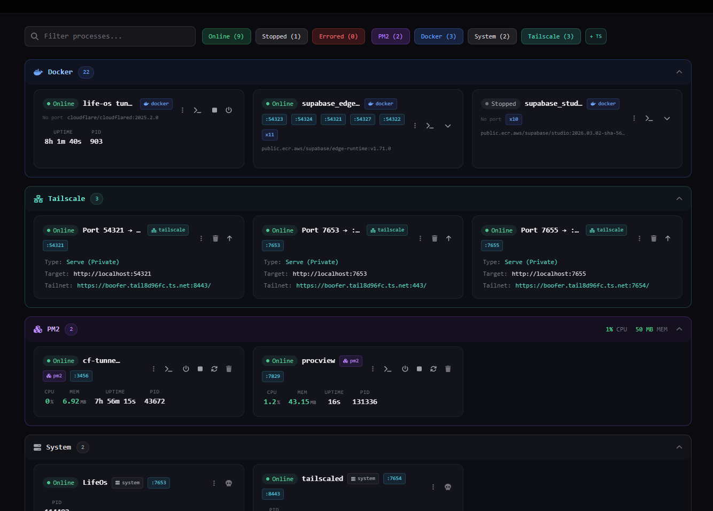
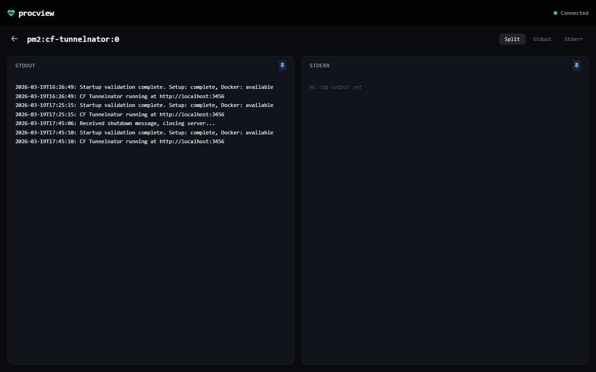

# Procview

Your local command center for every running process. PM2 apps, Docker containers, Tailscale tunnels, dev servers on ports — all in one dashboard, all in real time.




## Why Procview?

If you're running a local dev stack, you probably have PM2 managing some services, Docker running databases or infra, Tailscale exposing things to your tailnet or the internet, and a few random `node` or `python` processes listening on ports. Procview sees all of them in one place — no more juggling `pm2 list`, `docker ps`, `tailscale serve status`, and `ss -tlnp` across terminal tabs.

## Features

- **PM2 Processes** — start, stop, restart, reload, delete, live log streaming
- **Docker Containers** — start, stop, restart, live log streaming
- **Tailscale Serve & Funnel** — view, add, remove, upgrade (serve→funnel), downgrade (funnel→serve) rules directly from the dashboard
- **System Processes** — see anything listening on a port, kill it
- **Real-time Updates** — WebSocket-powered, sub-second process list refresh
- **Search & Filter** — by name, status, or source (PM2 / Docker / System / Tailscale)
- **Click-to-Open** — click a process card to open its port in a new tab
- **Per-Process Settings** — rename processes, add notes, hide the ones you don't care about
- **SQLite Persistence** — settings survive restarts
- **Graceful Degradation** — each source collector is independent; if Docker isn't running, PM2 and system processes still work fine
- **Live Log Viewer** — split stdout/stderr panes with auto-scroll pinning



## Quick Start

```bash
git clone https://github.com/skibsthebear/procview.git
cd procview
yarn install
yarn dev
```

Open [http://localhost:7829](http://localhost:7829).

### PowerShell (Windows)

```powershell
.\start.ps1            # Production mode with rebuild
.\start.ps1 -Dev       # Dev mode with hot-reload
.\start.ps1 -Port 3000 # Custom port
```

## Requirements

- **Node.js 18+**
- **PM2** (optional) — install globally with `npm i -g pm2` to manage PM2 processes
- **Docker Desktop** (optional) — for Docker container management
- **Tailscale CLI** (optional) — for Tailscale Serve/Funnel management

None of the optional dependencies are required. Procview gracefully skips any source that isn't available.

## Configuration

Create a `.env.local` file or set environment variables:

| Variable | Default | Description |
|---|---|---|
| `PORT` | `7829` | Server port |
| `PM2_POLL_INTERVAL` | `7829` | PM2 polling interval (ms) |
| `DOCKER_POLL_INTERVAL` | `10000` | Docker polling interval (ms) |
| `SYSTEM_POLL_INTERVAL` | `30000` | System process polling interval (ms) |
| `TAILSCALE_POLL_INTERVAL` | `15000` | Tailscale polling interval (ms) |
| `COLLECTOR_RETRY_INTERVAL` | `60000` | Retry interval for failed collectors (ms) |
| `COLLECTOR_MAX_FAILURES` | `3` | Failures before a collector is marked degraded |
| `LOG_LINES` | `200` | Initial log lines to load |
| `DATABASE_PATH` | `./data/procview.db` | SQLite database path |

## Architecture

Next.js 14 with App Router and a custom server (`server.js`) that runs HTTP and WebSocket on a single port. Four independent collectors poll PM2, Docker, system processes, and Tailscale on their own intervals. The collector registry merges results into a unified process list and broadcasts diffs over WebSocket to all connected clients.

```
Browser ←── WebSocket ──→ server.js
                            ├── PM2 Collector (pm2 daemon)
                            ├── Docker Collector (dockerode)
                            ├── System Collector (ss/netstat)
                            ├── Tailscale Collector (tailscale CLI)
                            └── SQLite (settings persistence)
```

## Commands

| Command | Description |
|---|---|
| `yarn dev` | Dev server with file watching |
| `yarn build` | Production build |
| `yarn start` | Production server |
| `yarn lint` | ESLint |
| `yarn test` | Run tests (Vitest) |
| `yarn test:watch` | Watch mode tests |

## Running with PM2

Procview includes an `ecosystem.config.js` for running as a PM2-managed process.

```bash
# Start with default port (7829)
pm2 start ecosystem.config.js

# Start with a custom port
PORT=3000 pm2 start ecosystem.config.js
```

On Windows (PowerShell):

```powershell
$env:PORT=3000; pm2 start ecosystem.config.js
```

### Persist across reboots

**Linux / macOS:**

```bash
pm2 startup
pm2 save
```

**Windows:**

```bash
npm install pm2-windows-startup -g
pm2-startup install
pm2 save
```

### Common commands

| Command | Description |
|---|---|
| `pm2 stop procview` | Stop (keeps in PM2 list) |
| `pm2 restart procview` | Hard restart |
| `pm2 delete procview` | Stop and remove from list |
| `pm2 logs procview` | Stream logs |

## License

MIT — see [LICENSE](LICENSE).

## Attribution

Originally inspired by [thenickygee/pm2-ui](https://github.com/thenickygee/pm2-ui). Substantially rewritten and expanded by [Sakib Rahman](https://github.com/skibsthebear).
